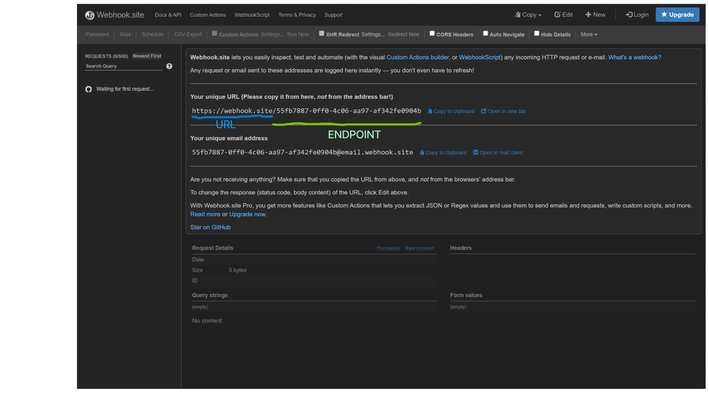

# Fullstack Coding Test

Instructions:
- Clone this repository.
- Go to https://webhook.site/
- Set-up our env
- running the server; npm run dev
- Test the endpoint with this command; npx ts-node src/get-process.test.ts
- Explain what the program does, if you find a bug, provide the solution.
- You can explain by add more line in this file. if you needed to modify the program, feel free.
- push this repo to your private repository and add our github account as colaborator when you finish your work.

